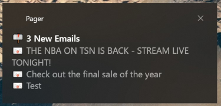

# Pager

Pager is a Windows 10 background service which displays toast notifications for your Google account's mail & calendar 
services.



This application is intended for power users who are familiar with operating PowerShell.

## Installation & Getting Running

1. Download from the releases section & place where ever you desire. 
   e.g. `C:\Program Files\Pager\Pager.exe`
2. Open PowerShell and run the `profile -auth` command to create a new profile and consent to OAuth scopes with your 
   Google account. Please use `-help` to read more about its functionality.
3. Create a shortcut to the executable with the `run` argument in your Start Menu's "Startup" folder.
   e.g. `C:\Program Files\Pager\Pager.exe run`

Your user start up folder can be found at: `%APPDATA%\Microsoft\Windows\Start Menu\Programs\Startup`.

## Building for Yourself

1. Create an additional Go file, perhaps `credentials.go`, and set the GoogleCredentials byte array to the JSON string
you acquired from your Google console.
2. Build & install with `go install -ldflags -H=windowsgui` to ensure there is no command line window when running.
3. Follow the steps in Installation & Getting Running.

## Settings

The settings for Pager can be found at `%APPDATA%\Pager\config.toml`. Below is an example of its contents.

```toml
PollDeltaEmail = 300000000000
PollDeltaCalendar = 300000000000

[[GoogleServices]]
  Name = "Personal"
  Token = "..."
  Calendars = ["mypersonal@gmail.com"]

[[GoogleServices]]
  Name = "Work"
  Token = "..."
  Calendars = ["mywork@bigcompany.com", "my secret work calendar"]
```

Please see [https://toml.io/en/](https://toml.io/en/) for more information on the TOML specification.

### Settings Fields

#### PollDeltaEmail

The time in milliseconds in which to poll all mail services for new emails.

#### PollDeltaCalendar

The time in milliseconds in which to poll all calendar services to refresh the agenda.

#### GoogleServices

This is a list of Google profiles. Each must have a name and its own OAuth token. It is better managed by the `profile`
command.

## Privacy Policy

This software, Pager, does not track and or collect any personal information. The software does not communicate with 
any parties than otherwise listed below.

 * Google - To communicate with Google's services to enable core functionality of the software.

### Google Scope Usage

 * Gmail (Read Only) - To pull the latest unread emails within the last day. These are then displayed to the user with a
   toast notification. Emails are polled at the desired rate in the settings.
 * Calendar (Read Only) - To pull the events happening in the next 12 hours. Upon an event starting it is displayed with
   a toast notification. Events are polled at the desired rate in the settings.

## Terms & Conditions

THE SOFTWARE IS PROVIDED "AS IS", WITHOUT WARRANTY OF ANY KIND, EXPRESS OR
IMPLIED, INCLUDING BUT NOT LIMITED TO THE WARRANTIES OF MERCHANTABILITY,
FITNESS FOR A PARTICULAR PURPOSE AND NONINFRINGEMENT. IN NO EVENT SHALL THE
AUTHORS OR COPYRIGHT HOLDERS BE LIABLE FOR ANY CLAIM, DAMAGES OR OTHER
LIABILITY, WHETHER IN AN ACTION OF CONTRACT, TORT OR OTHERWISE, ARISING FROM,
OUT OF OR IN CONNECTION WITH THE SOFTWARE OR THE USE OR OTHER DEALINGS IN THE
SOFTWARE.
